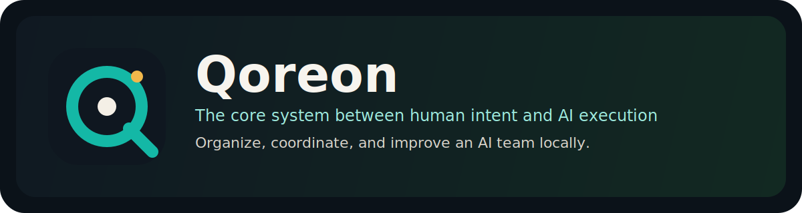

# Qoreon



Qoreon is the core system between human intent and AI execution.

Organize, coordinate, and continuously improve an AI team.
You no longer use one AI directly. You manage an AI team.

Run locally, connect Codex, Claude Code and other CLI agents, and add one unified coordination and control layer on top.

## Why Qoreon

Most AI tooling stops at "one prompt, one answer". Qoreon is built for a different operating model:

- Turn markdown task spaces into a visible control board.
- Coordinate multiple AI agents around channels, tasks, feedback, and sediment.
- Keep execution local-first and controllable.
- Ship a reusable example project, seed packs, and AI bootstrap instructions together.

## What Ships In V1

- Core pipeline: `task_dashboard/`, `server.py`, `build_project_task_dashboard.py`
- Pages: task, overview, communication audit, status report, agent directory, agent curtain, relationship board, session health
- Example workspace: `examples/minimal-project/`
- Public bootstrap kit: `docs/public/`, `examples/minimal-project/seed/`, `examples/minimal-project/skills/`
- Local demo runtime on `127.0.0.1:18770`

## Quick Start

1. Use Python `3.11+`
2. Copy config if needed:

```bash
cp config.example.toml config.toml
```

3. Build static pages:

```bash
python3 build_project_task_dashboard.py
```

4. Start the local service:

```bash
python3 server.py --port 18770
```

5. Open:

- `http://127.0.0.1:18770/project-task-dashboard.html`
- `http://127.0.0.1:18770/project-overview-dashboard.html`
- `http://127.0.0.1:18770/project-status-report.html`
- `http://127.0.0.1:18770/__health`

## Read In This Order

- `docs/public/quick-start.md`
- `docs/public/ai-bootstrap.md`
- `docs/public/github-homepage-kit.md`
- `docs/public/brand/logo-direction.md`
- `docs/public/launch/first-wave.md`
- `examples/minimal-project/README.md`
- `examples/minimal-project/seed/seed-inventory.json`

## Repo Structure

- `task_dashboard/`: Python build engine and runtime
- `web/`: page templates and browser scripts
- `examples/minimal-project/`: public example project
- `assets/brand/`: brand draft assets for GitHub and launch
- `docs/public/`: public-facing docs and launch material
- `docs/status-report/`: status report source
- `tests/`: minimal public test suite

## Product Positioning

Qoreon is not just a dashboard and not just an agent runner.

It is:

- a local control layer for multi-agent execution
- a collaboration model built around channels and task spaces
- a bootstrap pack that helps another AI continue the work correctly

It is not:

- a hosted SaaS in this repository
- a remote cloud orchestrator by default
- a production data sync tool out of the box

## Design Boundaries

- default bind is `127.0.0.1`
- no real sessions, real runs, or internal task spaces are bundled
- only public-safe seed packs and skills are included
- Git bridge capability defaults to `read_only / dry_run`

## Validation

```bash
python3 -m unittest discover -s tests -p 'test_*.py' -v
```

## License

MIT. See `LICENSE`.
